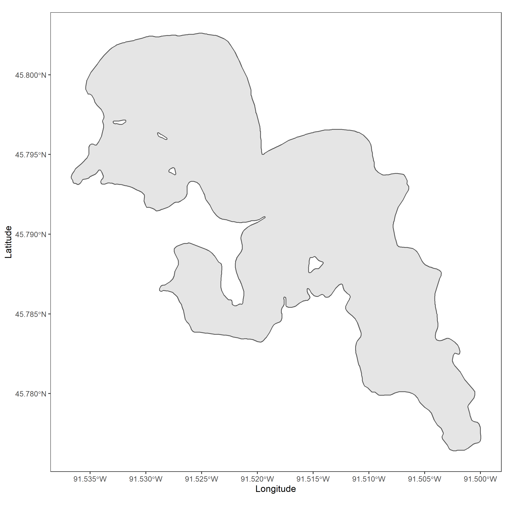
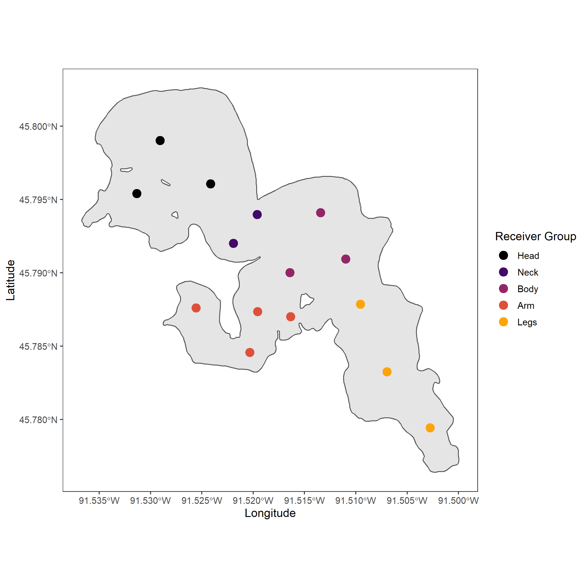
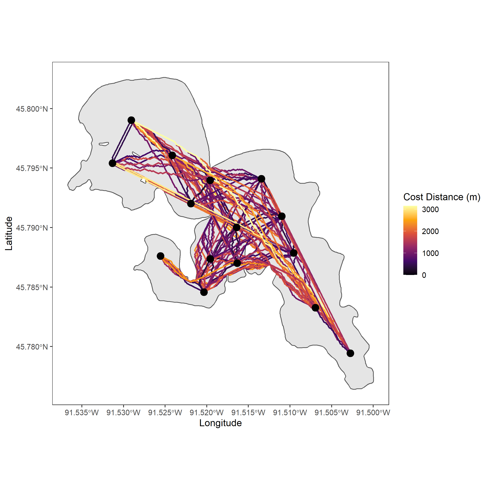

# Shortest Path Example

This tutorial demonstrates how to determine the shortest distance between 
points within a system, in this case, acoustic telemetry receivers used to 
track fish movements. However, it could be used for other situations where
you would want to determine the shortest distance between points within a confined
spatial shape. 

To use the tutorial, click the green code button to download the repository as either
a zip file or clone it using GitHub Desktop.

# Example Study Site 
I chose to use Big Sissabagama lake located in northwest Wisconsin, USA as the 
example study system.

I grew up fishing on this lake and for the sake of this tutorial, 
we will hypothetically have deployed 
an acoustic telemetry array within the lake to study walleye movements. 

From this plot we can use the function `shortestPath()` from [{gdistance}](https://agrdatasci.github.io/gdistance/) and  `st_as_sf()` and `st_length()` from [{sf}](https://r-spatial.github.io/sf/)
packages to first create shortest path linestrings between each receiver and 
secondly to determine the distance of the linestrings between each receiver. 

The sf object created can then be kept together or ripped apart 
to determine the distance or path a fish could swim within the system along with
a whole host of other potential implications (e.g. interpolated paths).

Credit: R. Lennox, PhD, for the original ideas around this script.  
